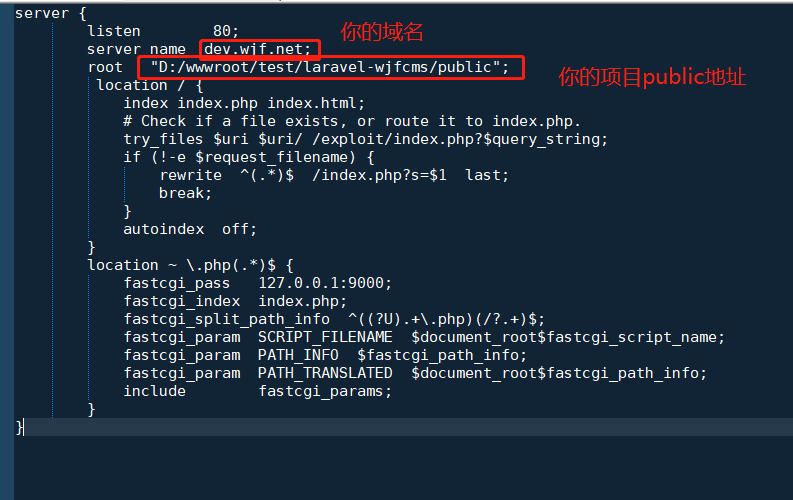

---

---

# 伪静态


 做完以上工作后,访问站点还存在问题,还需要配置伪静态,把站点运行目录指向public


## nginx配置

如果是nginx,大概的配置如下



```php

server {
        listen        80;
        server_name  dev.wjf.net;
        root   "D:/wwwroot/test/laravel-wjfcms/public";
         location / {
            index index.php index.html;
            # Check if a file exists, or route it to index.php.
			try_files $uri $uri/ /exploit/index.php?$query_string;
			if (!-e $request_filename) {
				rewrite  ^(.*)$  /index.php?s=$1  last;
				break;
			}
            autoindex  off;
        }
        location ~ \.php(.*)$ {
            fastcgi_pass   127.0.0.1:9000;
            fastcgi_index  index.php;
            fastcgi_split_path_info  ^((?U).+\.php)(/?.+)$;
            fastcgi_param  SCRIPT_FILENAME  $document_root$fastcgi_script_name;
            fastcgi_param  PATH_INFO  $fastcgi_path_info;
            fastcgi_param  PATH_TRANSLATED  $document_root$fastcgi_path_info;
            include        fastcgi_params;
        }
}
```


## 以宝塔为例

进入宝塔面板->站点,点击相应的站点


win下没有laravel5,选择thinkphp


 

# linux权限问题

在安装 Laravel 后，你可能需要配置一些权限。`storage`和`bootstrap/cache` 、`public`目录在你的 web 服务下应该是可写的权限，否则 Laravel 将无法运行。

报错如下:


 

运行如下命令

`sudo chmod -R 777 vendor storage bootstrap/cache`