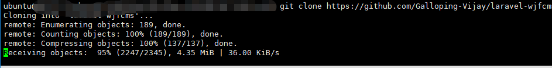
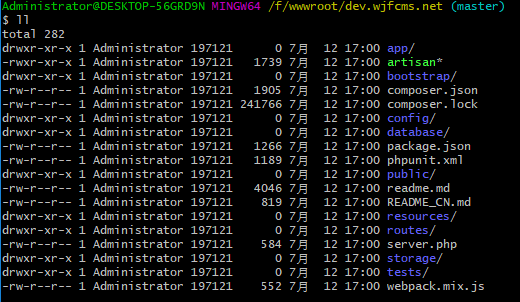
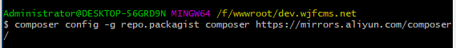
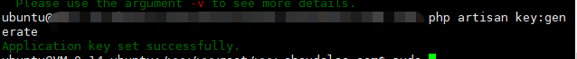

## 特别提醒

**linux下注意权限问题**

## 获取代码

github地址：[laravel-wjfcms](https://github.com/Galloping-Vijay/laravel-wjfcms) （欢迎 star 与 fork）

## 拉取代码

~~~shell
git clone https://github.com/Galloping-Vijay/laravel-wjfcms
~~~

> 如果github访问慢,可以换码云链接 

~~~shell
git clone https://gitee.com/Galloping-Vijay/laravel-wjfcms.git
~~~

win下


ubuntu下(注意权限)



## 进入项目目录

~~~shell
cd ./laravel-wjfcms
~~~



## 复制配置文件

> 我们需要复制跟目录下的`.env.example`文件并重命名为`.env`

~~~shell
cp .env.example .env
~~~

## 编辑 .env

我们需要改成自己的实际配置；  

APP_NAME 项目名称，如：blog；  

APP_URL 项目访问域名,如：www.choudalao.com；  

DB_DATABASE 数据库名；  

DB_USERNAME 数据库用户名 ；  

DB_PASSWORD 数据库密码 ；

APP_NAME="Vijay 个人博客"

APP_ENV=local

APP_KEY=

APP_DEBUG=true

APP_URL=www.choudalao.com

 

LOG_CHANNEL=stack

 

DB_CONNECTION=mysql

DB_HOST=127.0.0.1

DB_PORT=3306

DB_DATABASE=blog

DB_USERNAME=root

DB_PASSWORD=root

DB_PREFIX=wjf_


> 你的`.env`文件不应该提交到应用程序的源代码控制系统中，因为每个使用你的应用程序的开发人员 / 服务器可能需要有一个不同的环境配置。此外，在入侵者获得你的源代码控制仓库的访问权的情况下，这会成为一个安全隐患，因为任何敏感的凭据都被暴露了。

> 如果是团队开发，则可能希望应用程序中仍包含`.env.example`文件。因为通过在示例配置文件中放置占位值，团队中的其他开发人员可以清楚地看到哪些环境变量是运行应用程序所必需的。你也可以创建一个`.env.testing`文件，当运行 PHPUnit 测试或以`--env=testing`为选项执行 Artisan 命令时，该文件将覆盖`.env`文件中的值。

## 安装

> 推荐使用阿里云composer镜像

```shell
composer config -g repo.packagist composer https://mirrors.aliyun.com/composer/
```



> 运行

~~~powershell
composer install 
~~~


## 设置laravel应用密钥

~~~shell
php artisan key:generate
~~~



## 创建数据表

~~~shell
php artisan migrate
~~~


## 生成初始数据

~~~shell
php artisan db:seed
~~~

> 如果数据出现问题，可以执行清空操作 再 db:seed

~~~
php artisan cache:clear
~~~

> Artisan 是 Laravel 自带的命令行接口，他提供了许多使用的命令来帮助你构建 Laravel 应用 。要查看所有可用的 Artisan 命令的列表

```shell
php artisan list
```

更多操作请点击查看[Artisan 命令行](https://learnku.com/docs/laravel/5.8/artisan/3913)

## 访问
至此安装完成，后台地址为:域名/admin，如：http://dev.wjf.net/admin

后台默认账号 :13000000000

密码:123456
